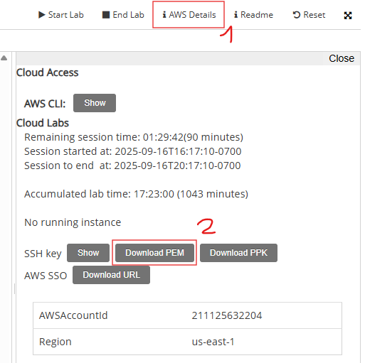

# TP3 – LOG8415E – Polytechnique Montréal

This project is the first practical assignment (TP3) for the course **LOG8415E** at **Polytechnique Montréal**.

## 🧠 Objective

The goal is to create a Python script (`TP3.py`) that deploys on AWS a **MYSQL Database Cluster** composed of:

- A gatekeeper
- A proxy
- 1 master
- 2 workers

---

## 🛠️ Environment Configuration

Before proceeding, set up a Python virtual environment and install the required dependencies:

```bash
python3 -m venv ~/awscli-venv
source ~/awscli-venv/bin/activate
pip install --upgrade pip
pip install -r requirements.txt
```

## ⚙️ Setup Instructions

### 1. Connect to AWS CLI

Follow the instructions shown in the image below to configure your local machine with AWS CLI access.

- Run the command

```bash
nano ~/.aws/credentials
```

- Ajust parameter for the one found in your aws student console
- 
- Verify that you are logged by running:

```bash
aws sts get-caller-identity | tee
```

### 2. Configure user profile AWS region

- Open the AWS config file:

```bash
nano ~/.aws/config
```

- Add or update the following lines to set the default region:

```
[default]
region = us-east-1
```

- Save and close the file.

### 3. Download the default key pair

In your learner lab page download the default key pair as follow`<br/>`
`<br/>`

> Then copy it into the project root directory and apply correct rights with command:

```bash
chmod 400 labsuser.pem
```

---

### 4. Create a new key pair (if you do not have `labsuser.pem`)

If you do not have a key pair named `labsuser` in your AWS account, create one using the AWS CLI:

```bash
aws ec2 create-key-pair --region us-east-1 --key-name labsuser --query 'KeyMaterial' --output text > labsuser.pem
```

This command creates a new key pair named `labsuser` with the private key as `labsuser.pem` in your aws account.

## 🚀 Deployment

Run the script to deploy the infrastructure:

```bash
python3 -m venv venv
source venv/bin/activate
pip install -r requirement.txt
python3 TP3.py
```

## 📊 Benchmarking

After the infrastructure is healthy, retrieve your Load Balancer DNS name, then run the benchmark tests:

```bash
python3 benchmark.py <gatekeeper_ip_address>
```

## ✅ Completion

You have now completed the practical portion of TP1. Move to analysis part
